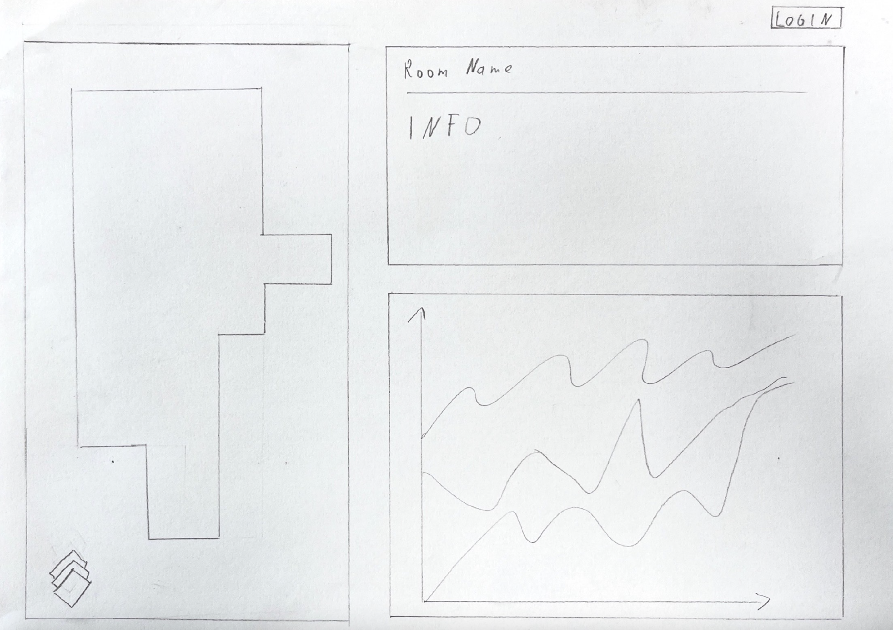

= Leo IOT Dashboard

Dieses Repository beinhaltet die Dokumentation zum Einrichten und Verwalten des IOT Dashboards der HTL Leonding mit Grafana. (Template Dashboard Anleitung siehe https://github.com/2223-4bhitm-itp/2223-4bhitm-project-iot-dashboard/tree/main/docs/deployment[hier]).

== Projektziel

Das Projektzeil ist die Visualisierung der Raumklimata der HTL Leonding und ein Dashboard für die Admin Verwaltung der Sensorboxen des Leo IOT Dashboards.

=== UCD

image::https://www.plantuml.com/plantuml/png/bL7BRi903BpxAomkb4D03JTKLI3w1mZkxgvBLje7NJijVVJV6mY9IjKScaFyy8vdTcSfIbdhu65SgHvaCPiTFCLJPsfIc0a_rnmD5zRHFbC066_N3rWCVU3vIL4JPhUl5AtBRDIb2416KyRHoWONdMYcfXmX2Lvr04u0YdlFk7aJvO0aNVO1YBMm8M4SxPpKvDqx8pKCBqs85bsy5C9H6hh7T6GvispNj_0td7DEkJjK_fUY0yu7jbjIwWGCBDSgirJ9Mrnvog6NKi8NmDNhO56q5xbf_XEStcEJb1DS81-LenLewtOm_p5eVIi7ZUlisJb-vTQNZQbIyhyLt7qMHJzguqLLULRLivTdNIuQNri6M7AqTV3V[]

=== Sprints
* 22-11-2022: Bis 29-11-2022:
** Wireframe vom Dashboard
** Quarkus Application ansehen

==== Liste: Was soll dargestellt werden?

* *Viewer*
** 2D-Modell von HTL Leonding
** Informationen über Raum nummerisch dargestellt (Temperatur, CO2-Wert, Luftfeuchtigkeit, Lautstärke, Helligkeit)
** Daten als Graph visualisieren, wobei man einstellen kann, welchen Wert man sich ansehen will
** Loginbutton für Adminansicht

* *Admin*, zusätzlich dazu
** Logoutbutton
** Aktive und passive Boxen
** Alerts
*** Grenzwertüberschreitungen
*** große Wertsprünge (Hysterese)
** Errors
*** Sensorausfall
*** Sensorboxausfall
*** MQTT-Server Error

* 29-11-2022: Bis 06-12-2022:
** Detail Daten werden von faker MQTT angezeigt
** GUI wird überarbeitet
** UCD wird überarbeitet

=== Wireframe
==== Admin View
image::docs/img/Wireframe.png[]
==== General View

