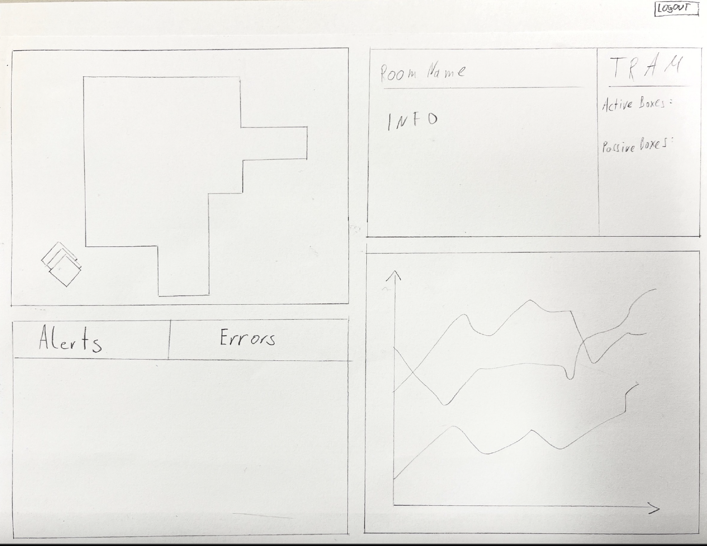

= Leo IOT Dashboard

Dieses Repository beinhaltet die Dokumentation zum Einrichten und Verwalten des IOT Dashboards der HTL Leonding mit Grafana. (Template Dashboard Anleitung siehe https://github.com/2223-4bhitm-itp/2223-4bhitm-project-iot-dashboard/tree/main/docs/deployment[hier]).

== Projektziel

Das Projektzeil ist die Visualisierung der Raumklimata der HTL Leonding und ein Dashboard für die Admin Verwaltung der Sensorboxen des Leo IOT Dashboards.

=== UCD

image::https://www.plantuml.com/plantuml/png/bP2nJiD038PtFuNLfNHeAzAj0oegRr2LtUHCSjBbhjW-A23UdKiW5KXa88lj-Fx__-IT6edbBi2yDJlfThq-1OhzdrMTkhNoK-POyz9vQeGwWFbnVuVBgGy2FnfQGl5DQ-YyS6q-HO2-eTW4niEh6dT8EdRlW9YLQrB6sRtNJC6_CL9HFfSI7VhuFIX7JO8FwSmwwosE-sluMyuYISP7rNyZHk5cmjsHqGWmOMwjiBOfEBmD9Dq5fO8FWAkYM-3g1ajJBN2BV3QEJg6VnyNcvsAuV8MJbo_uIVfyVc4PiWvrcr80-Af5ES3-7WUGIs0reFXOX-mOO5U2SnS-0G00[]

=== Sprints
* *22-11-2022: Bis 29-11-2022:*
** Wireframe vom Dashboard
** Quarkus Application ansehen

==== Liste: Was soll dargestellt werden?

* *Viewer*
** 2D-Modell von HTL Leonding
** Informationen über Raum nummerisch dargestellt (Temperatur, CO2-Wert, Luftfeuchtigkeit, Lautstärke, Helligkeit)
** Daten als Graph visualisieren, wobei man einstellen kann, welchen Wert man sich ansehen will
** Aktive und passive Boxen
** Alerts
*** Grenzwertüberschreitungen
*** große Wertsprünge (Hysterese)
** Errors
*** Sensorausfall
*** Sensorboxausfall
*** MQTT-Server Error

* *29-11-2022: Bis 06-12-2022:*
** Detail Daten werden von faker MQTT angezeigt
** GUI wird überarbeitet
** UCD wird überarbeitet

=== Wireframe
==== Dashboard View

