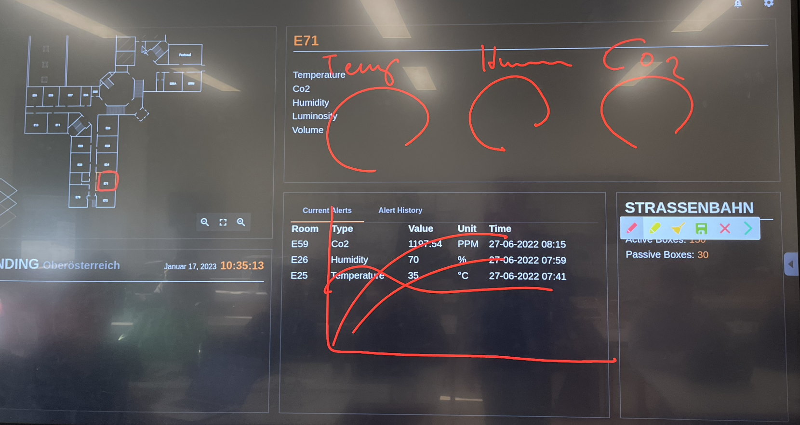
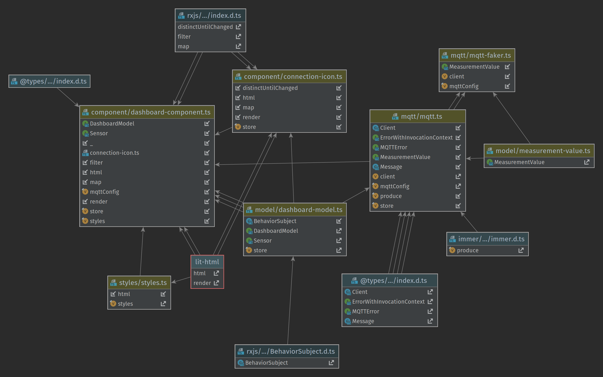
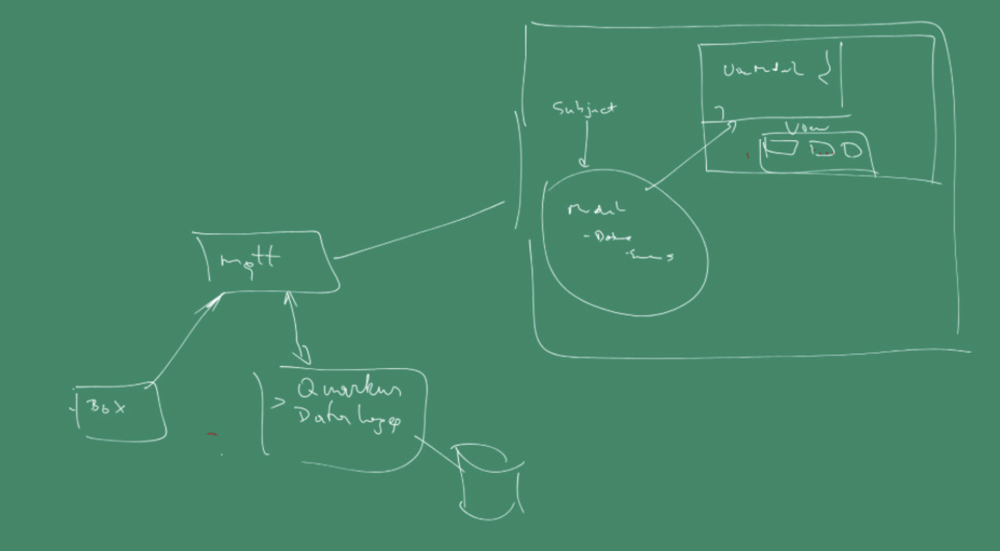
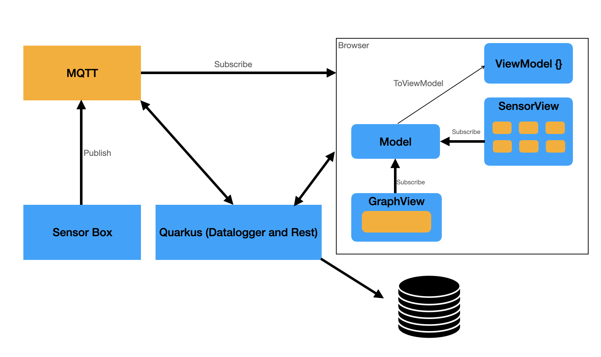

=== Sprints siehe YouTrack
* *22-11-2022: Bis 29-11-2022:*
** Wireframe vom Dashboard
** Quarkus Application ansehen

* *Start: 13-12-2022*
** Daten von MQTT-Server auf lokalem Dashboard anzeigen

==== Liste: Was soll dargestellt werden?

* *Viewer*
** 2D-Modell von HTL Leonding
** Informationen über Raum nummerisch dargestellt (Temperatur, CO2-Wert, Luftfeuchtigkeit, Lautstärke, Helligkeit)
** Daten als Graph visualisieren, wobei man einstellen kann, welchen Wert man sich ansehen will
** Aktive und passive Boxen
** Alerts
*** Grenzwertüberschreitungen
*** große Wertsprünge (Hysterese)
** Errors
*** Sensorausfall
*** Sensorboxausfall
*** MQTT-Server Error

* *29-11-2022: Bis 06-12-2022:*
** Detail Daten werden von faker MQTT angezeigt
** GUI wird überarbeitet
** UCD wird überarbeitet

=== Wireframe
==== Dashboard View
image::docs/img/Wireframe.png[]

* *Bis zum Tag der offenen Tür*
** Original dashboard mit Grafana bestücken
** Schwellwerte anzeigen

=== *Nach Tag der offenen Tür*
** Neues Subnet für Docker definieren
*** 10.0.1.  /16
** Eine Liste von den Schritten wie wir alles installiert haben

=== *Besprechung am 07.02.2023*
** Zielsetzung
*** System Architecture zeichnen und aufbauen
*** *Als Schüler möchte ich nach dem klick auf den räum e61 die Grafik der Temperatur usw sehen.*
*** *Das Team hat die Leo boxen zu übernehmen*
*** *Eine Leo Box ist in der 4BHITM zu installieren*
*** *Das Team muss Leo Boxen flashen und mit ihnen kommunizieren können*
*** Wie spreche ich mit einer Leo Box?
*** Wie konfiguriere, flashe ich sie?
*** Umstellung auf secure MQTT
*** Genaue Definition des Dashboards
*** Situation der Repos muss unter Kontrolle gebracht werden

=== *Besprechung am 14.02.2023*
** Amerikanisches auf Europäisches Datum umstellen
** Datenbanken verstehen -> Wie kommen welche Daten wo hin
** Boxen -> *Welche* boxen und *wieviele* bekommen wir?
** Dasboard auf einer plain HTML seite
*** Soll auf der VM laufen
*** Soll durch eine URL erreichbar sein

=== How to update VM139 dashboard

* Im Dashboard Repository folgende Befehle nach Änderungen ausführen:
** docker build -t ghcr.io/leo-iot/leo-iot-web/app .
** docker push ghcr.io/leo-iot/leo-iot-web/app

* Dann auf der VM im Ordner /opt/docker/leo-iot folgende Befehle ausführen
** docker-compose pull
** docker-compose stop
** docker-compose rm -f
** docker-compose up -d

=== 08.03.23

=== How to configure LeoBox
** Connect Box to power grid
** If the green light blinks, connect to Box
via accespoint ESP..
** Configure the Box via HTTP GET requests:
** check the current config:
*** http://192.168.4.1/config
** set the right name for level and room number
*** http://192.168.4.1/config?thingname=stockwerk/roomname
** set the right name for level and room number
*** http://192.168.4.1/config?thingname=stockwerk/roomname
** connect the box to a network
*** http://192.168.4.1/config?ssid=iot
*** http://192.168.4.1/config?password=passme
** restart the box
*** http://192.168.4.1/restart

https://github.com/gkoe/esp-idf_21/blob/main/esp%20config.txt[Further configuration options]

LeoBox Daten werden auf Grafana Dashboard angezeigt

=== 14.03

Wann schreibt Quarkus die Daten in die Datenbank?
und wann die anderen, ...

=== Besprechung am 14.03.2023

1. Grafische Darstellung der Schule
2. Bei click auf Raum werden die Werte dieses Raumes dargestellt
3. Jeder Raum soll ein Symbol enthalten, falls eine Box installiert ist
4. Die Sensordaten sollen aktuell und im Zeitverlauf dargestellt werden
5. Es sollen Schwellwerte dokumentiert sein bei denen etwas passiert zB Senden einer Mitteilung
6. Der zustand des Neopixel Leuchtrings soll dargestellt werden (nice-to-have)
7. *Grundsatzentscheidung:* Das gesamte IoT Projekt wird in einem K8s-Namespace Installiert
** Umzug von Jakob Rathberger auf Namespace von Moritz Eder
** Erstellung einer zweiten Installation im Namespace von Paul Horner (Dokumentation der zu tätigenden Änderungen)
8. Dokumentation der einzelnen Komponenten
9. Documentation der Deployment-Pipeline

=== 17.03

* [*] https://student.cloud.htl-leonding.ac.at/m.eder3/backend

=== 19.03

* [*] https://student.cloud.htl-leonding.ac.at/m.eder3/frontend/dashboard

=== 21.03

Doku für Namespace Änderung erstellt

=== 22.03

Horner Backend deployed

* [*] https://student.cloud.htl-leonding.ac.at/p.horner/backend

Horner Frontend deployed

* [*] https://student.cloud.htl-leonding.ac.at/p.horner/frontend/dashboard

=== Besprechung am 11.04.2023

* Wann werden die Daten vom Dummy MqttServer eingespeist und wann die Daten der Sensoren?
* Wie kann die Datenquelle konfiguriert werden
* Wo laufen die Einzelnen Systeme MQTT, DUMMY, IOT Backend
* Erstellen einer gh actions Pipeline ci-cd
* Dashboard muss  neu gestaltet und implementiert werden
* Ein Zeitplan wird von der Gruppe vorgelegt (GANTT) Wann wird was fertig!

=== 11.04

https://github.com/leo-iot/leo-iot-web/commit/2408eec6f16b3b5bf6f6325033c2a550ddab4082[Komponenten angepasst]

https://github.com/leo-iot/leo-iot-web/commit/d915c5a8d4f841a3df4a57fe7affbe090483605f[Blinkender Punkt für installierte Box hinzugefügt]

=== 02.05

[plantuml]
-----
include::docs/img/zeitplan.puml[]
-----

=== 26.06

Projekt eingecheckt

=== 29.05

Data Model:

=== 30.05

Besprechung:

* Box neu konfigurieren an neuen mqtt Server
* Architektur zeichne für Dokumentation
* Von neuem mqtt Server Daten anzeigen von Box

==== MQTT Connections

Host: mqtt.htl-leonding.ac.at

User: leo-user oder leo-student

* mqtt secure
- Port 8883
- Encryption (tls) checked
* mqtt
- Port: 1883
* ws secure
- Port: 5055
- Encryption (tls) checked
* ws
- Port: 9418

=== Systemarchitektur (Zum Vergleich beide)

* Prof. Aberger

* Keynote

=== 13.06

Bug 1:

* JSON String vom Neopixel Topic ist inkorrekt, d.h. es können nicht alle Daten ausgelesen werden.

Bug 2:

* Einheiten werden bei den mqtt Werten noch nicht mitgeliefert, d.h. man weiß nicht welcher Wert zu welcher Einheit gehört.

=== 20.06

Neue Sensorbox konfiguriert e59_2

=== 19.10

Mitschrift Besprechung CRUCC, SCHRA

* range / legende für farben
* rssi als symbol
* Vergleich zu normalem / default Wert z.B. CO2 Wert
* auf englisch und deutsch

