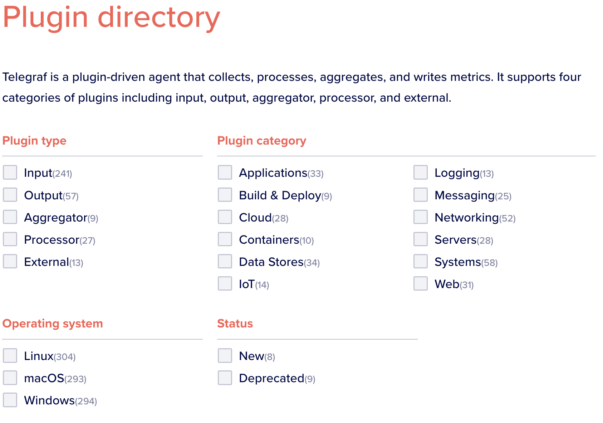

= Übersicht Telegraf 

=== Allgemeines
Telegraf ist ein Data Collector der Firma InfluxDB.
Telegraf sammelt auf jeglicher Ebene Daten ein.
Der Server Agent ist verschiedenste Plattformen erhältlich und für IOT-Anwendungen besonders geeignet.

image::asciidocs/images/telegraf.png[telegraf, 400]

=== Installation

Mac:
[source, shell]
----
brew install telegraf
----

Docker:
[source, shell]
----
docker pull telegraf
----

Ubuntu:
[source, shell]
----
wget -q https://repos.influxdata.com/influxdb.key
echo '23a1c8836f0afc5ed24e0486339d7cc8f6790b83886c4c96995b88a061c5bb5d influxdb.key' | sha256sum -c && cat influxdb.key | gpg --dearmor | sudo tee /etc/apt/trusted.gpg.d/influxdb.gpg > /dev/null
echo 'deb [signed-by=/etc/apt/trusted.gpg.d/influxdb.gpg] https://repos.influxdata.com/debian stable main' | sudo tee /etc/apt/sources.list.d/influxdata.list
sudo apt-get update && sudo apt-get install telegraf
----

Windows:
[source, shell]
----
> wget https://dl.influxdata.com/telegraf/releases/telegraf-1.24.2_windows_amd64.zip -UseBasicParsing -OutFile telegraf-1.24.2_windows_amd64.zip
> Expand-Archive .\telegraf-1.24.2_windows_amd64.zip -DestinationPath 'C:\Program Files\InfluxData\telegraf\'
----

=== Plugins

Es gibt dutzende Plugins, die das Arbeiten mit Telegraf massiv vereinfachen dies können einfach mittels des config files
hinzugefügt werden.

=== Demo
coming soon...

