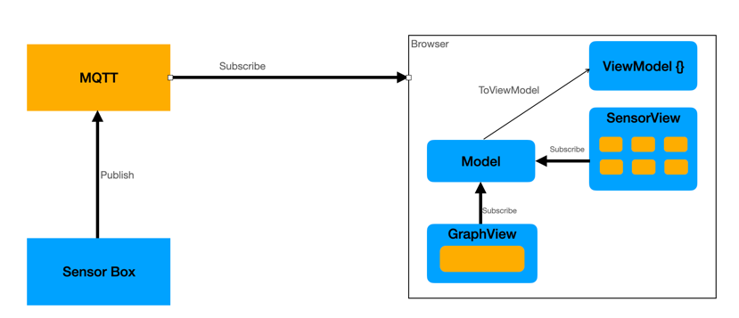

= Gesamtplaung Leo IOT

== Was Passiert dieses Jahr
* Eine Webseite mit einer übersicht über die Räume der HTL Leonding (2D Modell)
* Räume, in welchen eine Box steht sind Markiert (Durch zB. einen Grün blinkenden Punkt)
** Wenn man auf einen Raum klickt sieht man die Daten der Sensorbox in dem Raum
** Die Sensordaten werden mit aussagekräftigen Einheiten und Beschreibungen dargestellt
*** Wenn sinnvoll wird eine Grafische darstellung mit zB. einem Diagramm gemacht

* Deployment auf der Leocloud

== Zielarchitektur

== Was passiert beim nächsten Sprint

* Die Sensorboxen eines Stockwerks werden dargestellt
* Die Sensordaten werden mit aussagekräftigen Einheiten und Beschreibungen dargestellt
* Design für die Webseite

