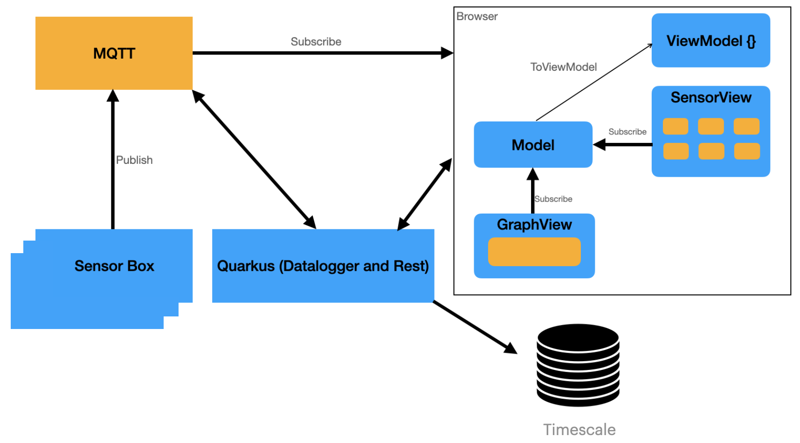

= IOT DASHBOARD

*Leo IOT erfasst Temperatur und Luftfeuchtigkeit in Schulgebäuden und zeigt die Daten in einem Dashboard an.*

== Nutzen

* Übersicht über Raumklimata

* Aufmerksamkeit für schlechte Luftqualität

* Optimales Lernklima in der Klasse

=== Ziel Architektur

=== UCD

https://2223-4bhitm-itp.github.io/2223-4bhitm-project-iot-dashboard[Dokumentation]

=== Datenmodell Postgresql

image::http://www.plantuml.com/plantuml/png/LO_12i9034Jl-OgmHw47_w2W5y6ZTrdRM1VMRCcc1odzTmreP6-PcJS3wQj6qUMP8TDTKGjAcXwAOn8QD1M6GuwruhaCqIIky3klfoFSY8bvuGakhvdCcQCGAspVdjcuUkgy0xvcI3FkfGtSngxpnjyC-s11s8Ls3XfbkM56cuQUUFny_WO0[Datenmodell]

