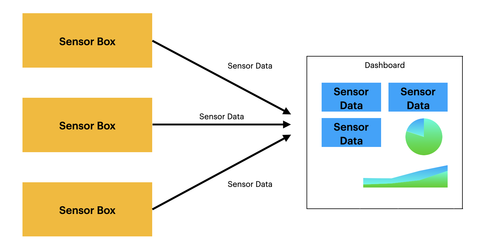

= Leo IOT

*Leo IOT erfasst Temperatur und Luftfeuchtigkeit in Schulgebäuden und stellt die Daten in einem Dashboard dar.*

[slidenumbers]
== Nutzen von Leo IOT

- Übersicht über Raumklimata

- Aufmerksamkeit für schlechte Luftqualität

- Optimales Lernklima in der Klasse

image::../images/pexels-andrea-piacquadio-3755755.jpg[Bad Air,300,200]

== Slide 2: Main Topic

.
====
[.content]
[.centered]
Genügend gute Luft und passende Temperatur sind wichtig!
====

== Funktionsweise

== Ziel-Architektur

image::../images/Zeil-Architektur.png[size=cover]

== LIVE DEMO
