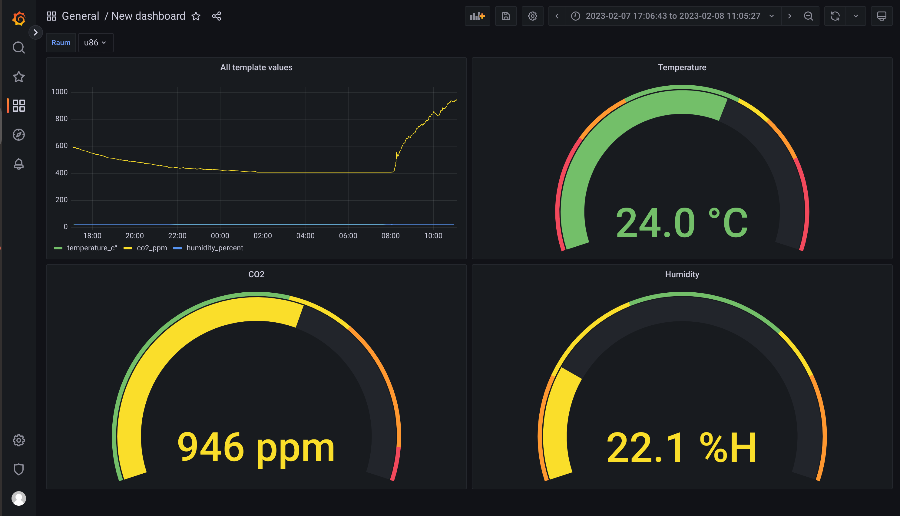

= Leo IOT Dashboard

== Per Leotux auf die VM139 zugreifen

-----
ssh <schuluser einfügen>@leotux.htl-leonding.ac.at
-----

* mit eigenem Passwort anmelden

-----
ssh iotadmin@vm139.htl-leonding.ac.at
-----

== Grafana

Grafana Dashboard auf der vm139:
http://vm139.htl-leonding.ac.at:3000/

Diagramme:

== Docker-compose auf vm139

.docker-compose.yml
[source,yaml]
----
version: '3.7'

services:
  leo-iot-web:
    depends_on: [ leo-iot-db, leo-iot-server ]
    image: ghcr.io/leo-iot/leo-iot-web/app
    container_name: leo-iot-web
    ports:
      - "80:80"
    networks:
      - iot_net

  leo-iot-server:
    depends_on: [leo-iot-db]
    image: ghcr.io/leo-iot/leo-iot-server/app
    container_name: leo-iot-server
    ports:
      - "8080:8080"  # the HTTP endpoint
    extra_hosts:
      - "vm90.htl-leonding.ac.at:10.191.112.90"
    networks:
      - iot_net
    restart: always

  leo-iot-db:
    image: ghcr.io/leo-iot/leo-iot-database/app
    container_name: leo-iot-database
    environment:
      POSTGRES_PASSWORD: app
      POSTGRES_USER: app
      POSTGRES_DB: db
    volumes:
      - ./data/:/var/lib/postgresql/data
    ports:
      - "5432:5432"
    networks:
      - iot_net

  leo-iot-grafana:
    image: grafana/grafana:9.3.6
    container_name: leo-iot-grafana
    ports:
      - 3000:3000
    volumes:
      - grafana-storage:/var/lib/grafana
      - ./grafana.ini:/etc/grafana/grafana.ini
    environment:
      - GF_SECURITY_ALLOW_EMBEDDING=true <1>
      - GF_AUTH_ANONYMOUS_ENABLED=true <2>
    networks:
      - iot_net

networks:
  iot_net:
    ipam:
      driver: default
      config:
        - subnet: 10.139.1.0/16

volumes:
  grafana-storage:
----

==== Settings:

<1> Damit das iframe überhaupt angezeigt wird
<2> Damit man nicht in einen Anmelde-Loop kommt

Lösung: https://stackoverflow.com/questions/57315587/how-to-authenticate-and-embedded-grafana-charts-into-iframe

