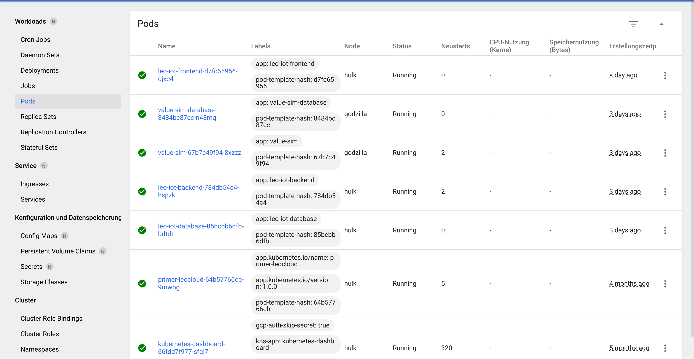

= Anleitung Kopieren eines K8s-Namespaces in der LeoCloud
Moritz Eder
:toc:
:icons: font
:sectnums:

== Git

.leo-iot-core Repo auschecken
----
git clone https://github.com/leo-iot/leo-iot-core.git
----

.auf k8s-deployment branch wechseln
----
git checkout feature/k8s-deployment
----

&&

.leo-iot-web Repo auschecken
----
git clone https://github.com/leo-iot/leo-iot-web.git
----

.auf k8s-deployment branch wechseln
----
git checkout feature/k8s-deployment
----

beide Projekte öffnen

== Install kind

.Ubuntu
-----
curl -Lo ./kind https://kind.sigs.k8s.io/dl/v0.17.0/kind-linux-amd64
chmod +x ./kind
sudo mv ./kind /usr/local/bin/kind
-----

.Mac
-----
brew install kind
-----

.Windows
-----
¯\_(ツ)_/¯
-----

== Kubernetes

https://kubernetes.io/docs/tasks/tools/[Install kubectl]

IMPORTANT: Befehle im CORE Repo auf dem k8s-deployment branch

-----
kind create cluster --config ./k8s-manifests/cluster-config.yaml
-----

-----
kubectl apply -f https://raw.githubusercontent.com/kubernetes/ingress-nginx/helm-chart-4.2.1/deploy/static/provider/kind/deploy.yaml
-----

-----
kubectl wait -n ingress-nginx --for=condition=ready pod --selector=app.kubernetes.io/component=controller --timeout=90s
-----

=== Namespace ändern für Backend

In folgenden Files Namespace auf den eigenen ändern

* backend.yaml
* frontend.yaml

z.B. path: /j.rathberger/backend(/|$)(.*)$
    ->
    path: /m.eder3/backend(/|$)(.*)$

Sobald der dritte Befehl fertig ist, folgende auch auf demselben branch ausführen:

-----
kubectl apply -f ./k8s-manifests/database.yaml
kubectl apply -f ./k8s-manifests/backend.yaml
kubectl apply -f ./k8s-manifests/frontend.yaml
kubectl apply -f ./k8s-manifests/value-sim-database.yaml
kubectl apply -f ./k8s-manifests/value-sim.yaml
-----

* In der LeoCloud anmelden https://cloud.htl-leonding.ac.at/
* Auf mein Dashboard klicken und den Anweisungen folgen

-----
kubectl proxy
-----

Jetzt wurde erfolgreich das Backend auf deinen Namespace kopiert: https://student.cloud.htl-leonding.ac.at/<dein-namespace>/backend

=== Namespace ändern für Frontend

IMPORTANT: Nun in die Command Line vom Web Repo wechseln und auch auf den k8s-deployment branch

In den Files

* package.json
* environment.prod.ts

Den Namespace wieder ändern

.mit Token anmelden
----
docker login ghcr.io
----

IMPORTANT: Auf Github schauen, ob man Rechte fürs uploaden hat

.builden
-----
docker build -t ghcr.io/leo-iot/leo-iot-web-k8s/app:latest .
-----

.pushen
-----
docker push ghcr.io/leo-iot/leo-iot-web-k8s/app:latest
-----

IMPORTANT: Wieder folgende Befehle im Core Repo ausführen

-----
kubectl apply -f ./k8s-manifests/database.yaml
kubectl apply -f ./k8s-manifests/backend.yaml
kubectl apply -f ./k8s-manifests/frontend.yaml
kubectl apply -f ./k8s-manifests/value-sim-database.yaml
kubectl apply -f ./k8s-manifests/value-sim.yaml
-----

==== Pod löschen

* Im Frontend auf Pods navigieren

* Den leo-iot-frontend-xxxxxxxx Pod löschen
* Er startet von selbst neu

Jetzt wurde erfolgreich das Frontend auch auf deinen Namespace kopiert: https://student.cloud.htl-leonding.ac.at/<dein-namespace>/frontend/dashboard
